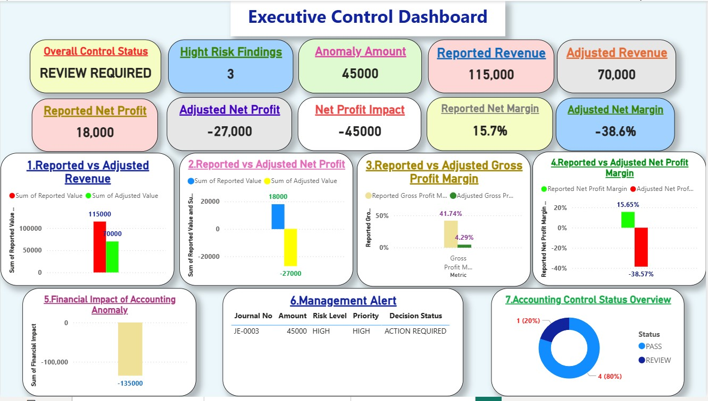
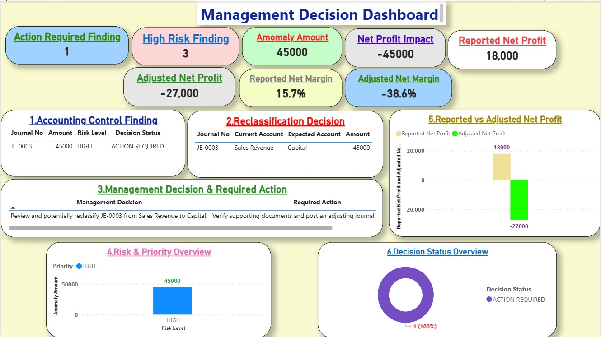
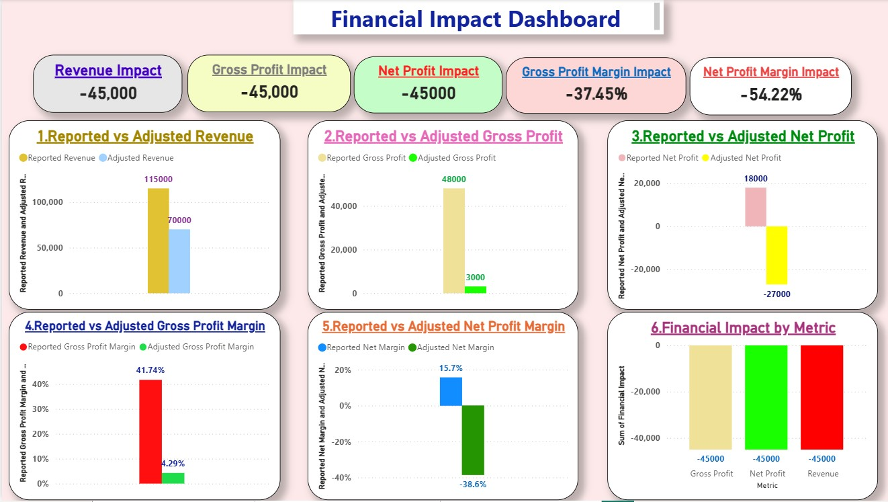

📊 Power BI Financial Control & Decision Support Dashboard

🎯 Project Overview

This project presents an Automated Financial Control & Decision Support Dashboard designed to transform accounting data into actionable financial and management insights.

The project combines Accounting, Python, Excel, Power BI, DAX, Data Validation, Financial Analysis, and Management Decision Support into one integrated analytical solution.

The dashboard focuses not only on reporting financial results, but also on identifying accounting control issues, measuring their financial impact, and translating findings into management actions.

🏆 Project Objective

The main objective of this project is to build an automated financial control and decision-support framework capable of:

- 🔹 Validating accounting records and financial statements
- 🔹 Detecting accounting anomalies and potential misclassifications
- 🔹 Measuring the financial impact of identified accounting issues
- 🔹 Calculating and validating financial KPIs
- 🔹 Monitoring profitability and financial performance
- 🔹 Identifying high-risk accounting findings
- 🔹 Generating management decision signals
- 🔹 Defining required management actions
- 🔹 Providing an executive-level financial control summary

🧾 Key Accounting Finding

The analysis identified a High-Risk Accounting Classification Issue involving:

JE-0003 – Capital Investment of 45,000 classified as Sales Revenue.

The issue was identified analytically through the financial control and validation process.

The original accounting data was not modified.

Instead, the project demonstrates how the accounting issue affects:

- 📌 Reported Revenue
- 📌 Adjusted Revenue
- 📌 Gross Profit
- 📌 Net Profit
- 📌 Profit Margins
- 📌 Financial KPIs
- 📌 Management Risk Assessment
- 📌 Required Management Action

This approach preserves the original accounting records while providing management with an analytical view of the potential financial impact.

🏗️ Project Architecture

The project follows an integrated workflow:

Accounting Data
      ↓
Excel Accounting System
      ↓
Python / Pandas Analysis
      ↓
Accounting Validation
      ↓
Anomaly Detection
      ↓
Financial Impact Analysis
      ↓
KPI & Ratio Analysis
      ↓
Decision Signals
      ↓
Management Actions
      ↓
Power BI Dashboards
      ↓
Executive Financial Control

📊 Power BI Dashboards

The final Power BI project contains three main dashboards.

🟦 1. Executive Control Dashboard

Provides management with a high-level view of:

- Overall Control Status
- High-Risk Findings
- Anomaly Amount
- Adjusted Net Profit
- Accounting Control Findings
- Executive Management Message
- Key Financial Control KPIs

The dashboard is designed to provide management with a single-page executive view of financial control status and exposure.

🟧 2. Management Decision Dashboard

Focuses on the management response to identified accounting issues.

It presents:

- Journal Entry Finding
- Risk Level
- Financial Exposure
- Accounting Control Finding
- Management Decision
- Required Action

The purpose is to convert accounting findings into clear management decisions and actionable recommendations.

🟩 3. Financial Impact Dashboard

Analyzes the financial consequences of the detected accounting classification issue.

The dashboard includes:

- Reported Revenue
- Adjusted Revenue
- Revenue Impact
- Reported Gross Profit
- Adjusted Gross Profit
- Gross Profit Impact
- Reported Net Profit
- Adjusted Net Profit
- Net Profit Impact
- Reported Net Margin
- Adjusted Net Margin
- Net Margin Impact
- Profitability KPI Impact

📸 Dashboard Screenshots

🟦 Executive Control Dashboard

🟧 Management Decision Dashboard

🟩 Financial Impact Dashboard

📌 Key KPI Measures

The Power BI model includes financial and control measures such as:

- 💰 Reported Revenue
- 💰 Adjusted Revenue
- 📉 Revenue Impact
- 💰 Reported Gross Profit
- 💰 Adjusted Gross Profit
- 📉 Gross Profit Impact
- 💰 Reported Net Profit
- 💰 Adjusted Net Profit
- 📉 Net Profit Impact
- 📊 Reported Gross Profit Margin
- 📊 Adjusted Gross Profit Margin
- 📊 Gross Profit Margin Impact
- 📊 Reported Net Margin
- 📊 Adjusted Net Margin
- 📊 Net Profit Margin Impact
- ⚠️ Anomaly Amount
- 🔴 High Risk Findings
- 🟠 Review Required Findings
- 🚨 Action Required Findings
- 📋 Total Control Findings
- ✅ Overall Control Status

🔍 Accounting Control Framework

The project incorporates several accounting control areas:

Control Area| Purpose
🧾 Journal Entry Validation| Identify unusual or potentially misclassified entries
⚖️ Accounting Balance| Validate accounting consistency
📊 Financial Statement Validation| Review reported financial results
💰 Revenue Validation| Identify potential revenue classification issues
📉 Profitability Validation| Measure impact on profit and margins
📌 KPI Validation| Validate financial indicators
⚠️ Risk Detection| Identify high-risk accounting findings
🚨 Action Monitoring| Identify required management actions

🐍 Python Analysis

Python was used as an analytical and validation layer.

Main technologies:

- Python
- Pandas
- NumPy
- Excel
- Data Validation
- Financial Analysis
- Accounting Controls

The Python workflow was used to:

1. Load accounting data
2. Inspect Excel datasets
3. Validate accounting structures
4. Analyze journal entries
5. Detect accounting anomalies
6. Calculate financial impacts
7. Validate KPIs
8. Generate management findings
9. Prepare Power BI build specifications
10. Validate the final dashboard build pack

📗 Excel Data

Excel was used as the underlying accounting and financial data source.

The project includes prepared financial-control data used to support the Power BI model.

The Excel layer supports:

- Accounting Data
- Journal Entries
- Financial Control Data
- KPI Data
- Management Findings
- Financial Impact Analysis

📦 Power BI Build Pack

The project includes a dedicated Power BI Build Pack containing the specifications required to build and validate the dashboard.

The Build Pack includes:

- 📄 Page Build Plan
- 📊 Executive Visuals
- 📊 Financial Impact Visuals
- 📊 Management Visuals
- 📌 KPI Cards
- 🧮 DAX Build Plan
- 🎨 Formatting Standard
- 🔢 Build Sequence

The Build Pack was validated successfully with:

POWER BI DASHBOARD BUILD PACK STATUS: PASS ✓

🧮 DAX & Power BI

DAX was used to create financial control and analytical measures.

The model includes measures for:

- Reported Financial Results
- Adjusted Financial Results
- Financial Impact
- Profitability
- Margins
- Accounting Anomalies
- Risk Findings
- Required Actions
- Overall Control Status

Power BI was then used to convert these analytical outputs into interactive management dashboards.

🛠️ Tools & Technologies

💻 Programming & Data Analysis

- 🐍 Python
- 🐼 Pandas
- 🔢 NumPy

📊 Business Intelligence

- 📊 Microsoft Power BI
- 🧮 DAX
- 🔄 Power Query

📗 Data & Accounting

- 📗 Microsoft Excel
- 🧾 Accounting Data
- 📒 Journal Entries
- 📊 Financial Analysis
- ⚖️ Accounting Controls

🤖 Decision Support

- 🔍 Anomaly Detection
- 📌 KPI Validation
- ⚠️ Risk Identification
- 🚨 Management Actions
- 📈 Financial Impact Analysis

📂 Project Files

The repository is organized as follows:

PowerBI_Financial_Control_Dashboard/
│
├── 01-PowerBI/
│   └── PowerBI_Financial_Control_Dashboard_Final.pbix
│
├── 02-PDF/
│   └── PowerBI_Financial_Control_Dashboard_Final.pdf
│
├── 03-Screenshots/
│   ├── 1.Executive_Control_Dashboard.jpg
│   ├── 2.Management_Decision_Dashboard.jpg
│   └── 3.Financial_Impact_Dashboard.jpg
│
├── 04-Excel_Data/
│   └── PowerBI_Financial_Control_Dashboard_Data.xlsx
│
├── 05-Build_Pack/
│   └── PowerBI_Financial_Control_Dashboard_Build_Pack.xlsx
│
├── 06-Python/
│   └── Automated-Financial-Decision-Support-Dashboard.ipynb
│
├── 07-Video/
│   └── PowerBI_Financial_Control_Dashboard_Data.mp4
│
└── README.md

🎥 Project Video

A project demonstration video is included in the repository:

"07-Video/PowerBI_Financial_Control_Dashboard_Data.mp4"

The video demonstrates the Power BI financial control and decision-support dashboard.

📄 Project Documentation

The repository includes a PDF version of the final Power BI dashboard for convenient review and presentation.

The PDF provides a static representation of the dashboard outputs.

📈 Business Value

This project demonstrates how accounting data can be transformed from traditional financial reporting into a financial control and management decision-support system.

The solution helps management answer questions such as:

- ❓ Is the accounting data reliable?
- ❓ Are there potential accounting classification issues?
- ❓ How much financial exposure exists?
- ❓ How does an accounting issue affect revenue?
- ❓ How does it affect profitability?
- ❓ How does it affect financial margins?
- ❓ What is the risk level?
- ❓ What management action is required?

💡 Key Project Insight

A major strength of this project is the separation between:

Reported Financial Results

and

Adjusted Financial Results

This allows management to understand the potential effect of an accounting classification issue without changing the original accounting records.

🎯 Professional Skills Demonstrated

This project demonstrates practical skills in:

- 🧾 Accounting
- 📊 Financial Analysis
- 📈 Business Intelligence
- 🧮 DAX
- 🐍 Python
- 🐼 Pandas
- 📗 Excel
- 🔄 Power Query
- 🔍 Data Validation
- ⚠️ Accounting Control
- 🚨 Risk Analysis
- 💼 Management Decision Support
- 📊 Executive Reporting
- 📌 KPI Development
- 📈 Financial Impact Analysis

🏁 Project Status

✅ PROJECT COMPLETED

Power BI Dashboard Build Pack: PASS ✓

Power BI Build Status: READY ✓

Dashboard Pages: READY ✓

Executive Control Analysis: READY ✓

Financial Impact Analysis: READY ✓

Management Decision Support: READY ✓

Python Analysis: COMPLETED ✓

Excel Data Layer: COMPLETED ✓

PDF Documentation: COMPLETED ✓

Dashboard Screenshots: COMPLETED ✓

Project Video: COMPLETED ✓

👤 Author

Mostafa Hisham Abdelghani Abuhasswa

Senior Accountant | Data Analyst | Financial Analysis & Business Intelligence

Core Areas

- Accounting & Financial Reporting
- Excel Financial Analysis
- Power BI
- DAX
- Python
- Data Analysis
- Financial Control
- Management Decision Support

⭐ Project Purpose

This project was developed as a practical demonstration of integrating Accounting + Data Analysis + Business Intelligence + Python + Power BI to create an automated financial control and management decision-support solution.
